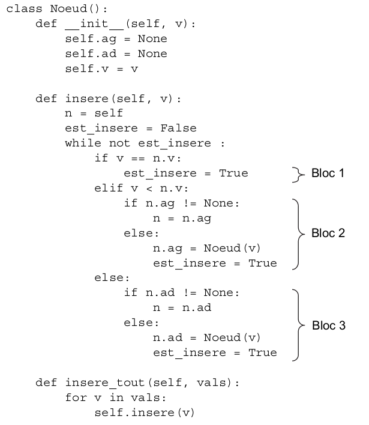
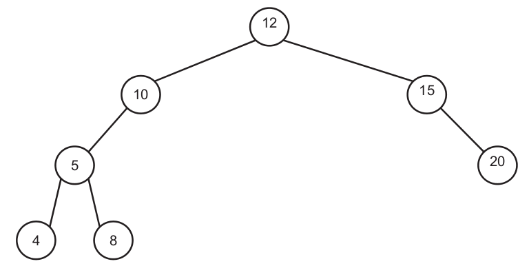

## Exercice 1
*2020, sujet 0*

**Question  1**

Déterminer la taille et la hauteur de l’arbre binaire suivant :
{: .center}

**Question 2**  

On décide de numéroter en binaire les nœuds d’un arbre binaire de la façon suivante :  

- la racine correspond à 1 ;
- la numérotation pour un fils gauche s’obtient en ajoutant le chiffre 0 à droite au numéro de son
père ;
- la numérotation pour un fils droit s’obtient en ajoutant le chiffre 1 à droite au numéro de son
père ;  


Par exemple, dans l’arbre ci-dessous, on a utilisé ce procédé pour numéroter les nœuds A, B, C, E et
F .

{: .center}

1. Dans l’exemple précédent, quel est le numéro en binaire associé au nœud G ?
2. Quel est le nœud dont le numéro en binaire vaut 13 en décimal ?
3. En notant $h$ la hauteur de l’arbre, sur combien de bits seront numérotés les nœuds les plus en
bas ?
4. Justifier que pour tout arbre de hauteur $h$ et de taille $n \geqslant 2$, on a :
$$ h \leqslant n \leqslant 2^h-1 $$


**Question 3**  
Un arbre binaire est dit complet si tous les niveaux de l’arbre sont remplis.
{: .center}

On décide de représenter un arbre binaire complet par un tableau de taille n + 1, où n est la taille de
l’arbre, de la façon suivante :  

- La racine a pour indice 1 ;
- Le fils gauche du nœud d’indice i a pour indice $2 \times i$ ;
- Le fils droit du nœud d’indice i a pour indice $2 \times i + 1$ ;
- On place la taille $n$ de l’arbre dans la case d’indice 0.

Répondre aux questions suivantes :  

1. Déterminer le tableau qui représente l’arbre binaire complet de l’exemple précédent.
2. On considère le père du nœud d’indice $i$ avec $i \geqslant 2$. Quel est son indice dans le tableau ?

**Question 4**  

On se place dans le cas particulier d’un arbre binaire de recherche complet où les nœuds
contiennent des entiers et pour lequel la valeur de chaque noeud est supérieure à celles des
noeuds de son fils gauche, et inférieure à celles des noeuds de son fils droit.


Écrire une fonction `recherche` ayant pour paramètres un arbre `arbre` et un élément `element`. Cette
fonction renvoie `True` si `element` est dans l’arbre et `False` sinon. L’arbre sera représenté par un tableau
comme dans la question précédente.

## Exercice 2
*2021, Métropole sujet 1*

Dans cet exercice, les arbres binaires de recherche ne peuvent pas comporter plusieurs fois la
même clé. De plus, un arbre binaire de recherche limité à un nœud a une hauteur de 1.
On considère l’arbre binaire de recherche représenté ci-dessous (figure 1), où `val` représente un entier :

{: .center}

**1.a** Donner le nombre de feuilles de cet arbre et préciser leur valeur (étiquette).  

**1.b** Donner le sous arbre-gauche du nœud 23.

**1.c** Donner la hauteur et la taille de l’arbre.

**1.d** Donner les valeurs entières possibles de `val` pour cet arbre binaire de recherche.

On suppose, pour la suite de cet exercice, que `val` est égal à 16.

**2.** On rappelle qu’un parcours infixe depuis un nœud consiste, dans l’ordre, à faire un parcours
infixe sur le sous arbre-gauche, afficher le nœud puis faire un parcours infixe sur le sous-arbre
droit.    
Dans le cas d’un parcours suffixe, on fait un parcours suffixe sur le sous-arbre gauche puis un
parcours suffixe sur le sous-arbre droit, avant d’afficher le nœud.

**a.** Donner les valeurs d’affichage des nœuds dans le cas du parcours infixe de l’arbre.  
**b**. Donner les valeurs d’affichage des nœuds dans le cas du parcours suffixe de l’arbre.


**3.** On considère la classe `Noeud` définie de la façon suivante en Python :

{: .center}


**a.** Représenter l’arbre construit suite à l’exécution de l’instruction suivante :

```python 
racine = Noeud(18)
racine.insere_tout([12, 13, 15, 16, 19, 21, 32, 23])
```
**b.** Écrire les deux instructions permettant de construire l’arbre de la figure 1. On rappelle que
le nombre `val` est égal à 16.

**c.** On considère l’arbre tel qu’il est présenté sur la figure 1. Déterminer l’ordre d’exécution des
blocs (repérés de 1 à 3) suite à l’application de la méthode `insere(19)` au nœud racine
de cet arbre.

**4.** Écrire une méthode `recherche(self, v)` qui prend en argument un entier `v` et renvoie la
valeur `True` si cet entier est une étiquette de l’arbre, `False` sinon.


## Exercice 3
*2021, Métropole Candidats Libres 2*

On rappelle qu’un arbre binaire est composé de nœuds, chacun des nœuds possédant
éventuellement un sous-arbre gauche et éventuellement un sous-arbre droit. Un nœud
sans sous-arbre est appelé feuille. La taille d’un arbre est le nombre de nœuds qu’il
contient ; sa hauteur est le nombre de nœuds du plus long chemin qui joint le nœud racine
à l’une des feuilles. Ainsi la hauteur d’un arbre réduit à un nœud, c’est-à-dire la racine,
est 1.


Dans un arbre binaire de recherche, chaque nœud contient une clé, ici un nombre entier,
qui est :

- strictement supérieure à toutes les clés des nœuds du sous-arbre gauche ;
- strictement inférieure à toutes les clés des nœuds du sous-arbre droit.


Un arbre binaire de recherche est dit « bien construit » s’il n’existe pas d’arbre de hauteur
inférieure qui pourrait contenir tous ses nœuds.


On considère l’arbre binaire de recherche ci-dessous.

{: .center}

**1.a.** Quelle est la taille de l’arbre ci-dessus ?  

**1.b.** Quelle est la hauteur de l’arbre ci-dessus ?

**2.** Cet arbre binaire de recherche n’est pas « bien construit ». Proposer un arbre
binaire de recherche contenant les mêmes clés et dont la hauteur est plus petite
que celle de l’arbre initial.

**3.** Les classes Noeud et Arbre ci-dessous permettent de mettre en œuvre en Python
la structure d’arbre binaire de recherche. La méthode insere permet d’insérer
récursivement une nouvelle clé.

```python linenums='1'
class Noeud :
    
    def __init__(self, cle):
        self.cle = cle
        self.gauche = None
        self.droit = None
        
    def insere(self, cle):
        if cle < self.cle :
            if self.gauche == None :
                self.gauche = Noeud(cle)
            else :
                self.gauche.insere(cle)
        elif cle > self.cle :
            if self.droit == None :
                self.droit = Noeud(cle)
            else :
                self.droit.insere(cle)
                
class Arbre :
    
    def __init__(self, cle):
        self.racine = Noeud(cle)

    def insere(self, cle):
        self.racine.insere(cle)

```

Donner la représentation de l’arbre codé par les instructions ci-dessous.

```python
a = Arbre(10)
a.insere(20)
a.insere(15)
a.insere(12)
a.insere(8)
a.insere(4)
a.insere(5)
```

**4.** Pour calculer la hauteur d’un arbre non vide, on a écrit la méthode ci-dessous dans
la classe Noeud.

```python
def hauteur(self):
    if self.gauche == None and self.droit == None:
        return 1
    if self.gauche == None:
        return 1 + self.droit.hauteur()
    elif self.droit == None:
        return 1 + self.gauche.hauteur()
    else:
        hg = self.gauche.hauteur()
        hd = self.droit.hauteur()
        if hg > hd:
            return hg + 1
        else:
            return hd + 1

```
Écrire la méthode `hauteur` de la classe `Arbre` qui renvoie la hauteur de
l’arbre.

**5.** Écrire les méthodes `taille` des classes `Noeud` et `Arbre` permettant de calculer
la taille d’un arbre.

**6.** On souhaite écrire une méthode `bien_construit` de la classe `Arbre` qui
renvoie la valeur `True` si l’arbre est « bien construit » et `False` sinon.

On rappelle que la taille maximale d’un arbre binaire de recherche de hauteur $ℎ$
est $2^h - 1$.

**6.a** Quelle est la taille minimale, notée `min` d’un arbre binaire de recherche
« bien construit » de hauteur $ℎ$ ?

**6.b** Écrire la méthode ```bien_construit``` demandée.
