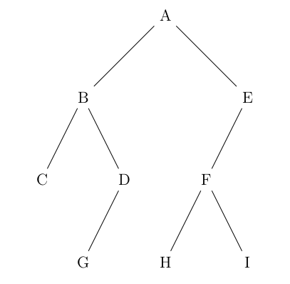
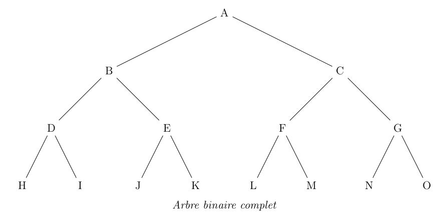
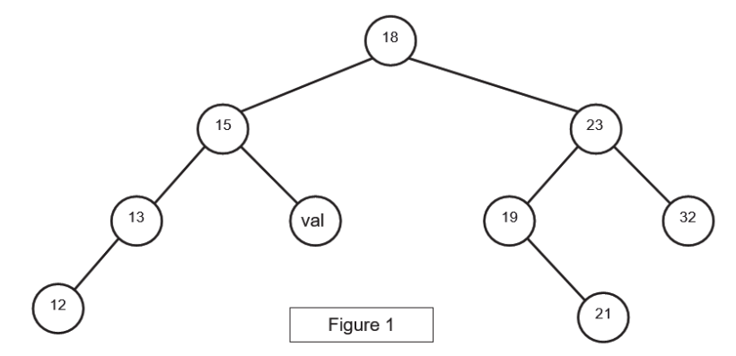
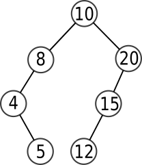
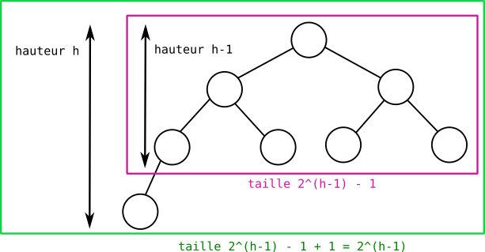
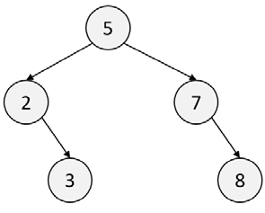
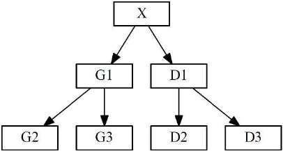
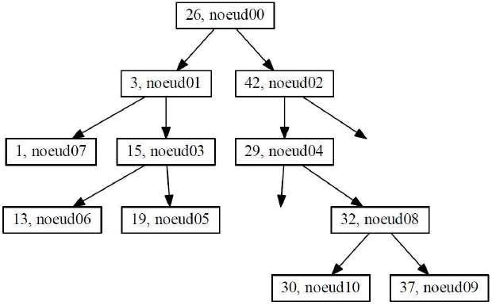

## Exercice 1
*2020, sujet 0*

**Question  1**

Déterminer la taille et la hauteur de l’arbre binaire suivant :
{: .center}

**Question 2**  

On décide de numéroter en binaire les nœuds d’un arbre binaire de la façon suivante :  

- la racine correspond à 1 ;
- la numérotation pour un fils gauche s’obtient en ajoutant le chiffre 0 à droite au numéro de son
père ;
- la numérotation pour un fils droit s’obtient en ajoutant le chiffre 1 à droite au numéro de son
père ;  


Par exemple, dans l’arbre ci-dessous, on a utilisé ce procédé pour numéroter les nœuds A, B, C, E et
F .

{: .center}

1. Dans l’exemple précédent, quel est le numéro en binaire associé au nœud G ?
2. Quel est le nœud dont le numéro en binaire vaut 13 en décimal ?
3. En notant $h$ la hauteur de l’arbre, sur combien de bits seront numérotés les nœuds les plus en
bas ?
4. Justifier que pour tout arbre de hauteur $h$ et de taille $n \geqslant 2$, on a :
$$ h \leqslant n \leqslant 2^h-1 $$


**Question 3**  
Un arbre binaire est dit complet si tous les niveaux de l’arbre sont remplis.
{: .center}

On décide de représenter un arbre binaire complet par un tableau de taille n + 1, où n est la taille de
l’arbre, de la façon suivante :  

- La racine a pour indice 1 ;
- Le fils gauche du nœud d’indice i a pour indice $2 \times i$ ;
- Le fils droit du nœud d’indice i a pour indice $2 \times i + 1$ ;
- On place la taille $n$ de l’arbre dans la case d’indice 0.

Répondre aux questions suivantes :  

1. Déterminer le tableau qui représente l’arbre binaire complet de l’exemple précédent.
2. On considère le père du nœud d’indice $i$ avec $i \geqslant 2$. Quel est son indice dans le tableau ?

**Question 4**  

On se place dans le cas particulier d’un arbre binaire de recherche complet où les nœuds
contiennent des entiers et pour lequel la valeur de chaque noeud est supérieure à celles des
noeuds de son fils gauche, et inférieure à celles des noeuds de son fils droit.


Écrire une fonction `recherche` ayant pour paramètres un arbre `arbre` et un élément `element`. Cette
fonction renvoie `True` si `element` est dans l’arbre et `False` sinon. L’arbre sera représenté par un tableau
comme dans la question précédente.


??? tip "corrigé"
    **Q1** La taille est 9, la hauteur est 4.  
    **Q2** 1. G est associé à 1010.   
    **Q2** 2. 13 s'écrit 1101 en binaire, c'est donc le nœud I.    
    **Q2** 3. Les nœuds les plus en bas sont notés sur $h$ bits.  
    **Q2** 4. L'arbre de hauteur $h$ de taille minimale est l'arbre filiforme, qui est de taille $h$.  
    L'arbre de hauteur $h$ de taille maximale est l'arbre complet, qui est de taille $2^h-1$. Si $n$ est la taille d'un arbre quelconque de taille $h$, on a donc bien $$ h \leqslant n \leqslant 2^h-1 $$.

    **Q3** 1. Tableau : ```[15, A, B, C, D, E, F, G, H, I, J, K, L, M, N, O]``` .  
    **Q3** 2. Le père du nœud d'indice ```i``` a pour indice ```i//2```.   

    **Q4** :
    ```python
    def recherche(arbre, element):
        i = 1
        while i < len(arbre):
            if arbre[i] == element:
                return True
            if element < arbre[i]:
                i = 2*i # on se place sur le fils gauche
            else:
                i = 2*i +  1 # on se place sur le fils droit
        return False
    ```

## Exercice 2
*2021, Métropole sujet 1*

Dans cet exercice, les arbres binaires de recherche ne peuvent pas comporter plusieurs fois la
même clé. De plus, un arbre binaire de recherche limité à un nœud a une hauteur de 1.
On considère l’arbre binaire de recherche représenté ci-dessous (figure 1), où `val` représente un entier :

{: .center}

**1.a** Donner le nombre de feuilles de cet arbre et préciser leur valeur (étiquette).  

**1.b** Donner le sous arbre-gauche du nœud 23.

**1.c** Donner la hauteur et la taille de l’arbre.

**1.d** Donner les valeurs entières possibles de `val` pour cet arbre binaire de recherche.

On suppose, pour la suite de cet exercice, que `val` est égal à 16.

**2.** On rappelle qu’un parcours infixe depuis un nœud consiste, dans l’ordre, à faire un parcours
infixe sur le sous arbre-gauche, afficher le nœud puis faire un parcours infixe sur le sous-arbre
droit.    
Dans le cas d’un parcours suffixe, on fait un parcours suffixe sur le sous-arbre gauche puis un
parcours suffixe sur le sous-arbre droit, avant d’afficher le nœud.

**a.** Donner les valeurs d’affichage des nœuds dans le cas du parcours infixe de l’arbre.  
**b**. Donner les valeurs d’affichage des nœuds dans le cas du parcours suffixe de l’arbre.


**3.** On considère la classe `Noeud` définie de la façon suivante en Python :

{: .center}


**a.** Représenter l’arbre construit suite à l’exécution de l’instruction suivante :

```python 
racine = Noeud(18)
racine.insere_tout([12, 13, 15, 16, 19, 21, 32, 23])
```
**b.** Écrire les deux instructions permettant de construire l’arbre de la figure 1. On rappelle que
le nombre `val` est égal à 16.

**c.** On considère l’arbre tel qu’il est présenté sur la figure 1. Déterminer l’ordre d’exécution des
blocs (repérés de 1 à 3) suite à l’application de la méthode `insere(19)` au nœud racine
de cet arbre.

**4.** Écrire une méthode `recherche(self, v)` qui prend en argument un entier `v` et renvoie la
valeur `True` si cet entier est une étiquette de l’arbre, `False` sinon.


??? tip "corrigé"
    **1.a.** Il y a 4 feuilles, d'étiquette 12, `val`, 21 et 32.  
    **1.b.** Le sous-arbre gauche du nœud 23 est 19-21.  
    **1.c.** La hauteur de l'arbre est 4. Sa taille est 9.  
    **1.d.** Les valeurs possibles de ```val``` sont 16 et 17.  

    **2.a.** Parcours infixe : 12-13-15-16-18-19-21-23-32  
    **2.b.** Parcours suffixe : 12-13-16-15-21-19-32-23-18  

    **3.a.** à venir  
    **3.b.**   
    ```python
    racine = Noeud(18)
    racine.insere([15, 13, 12, 16, 23, 32, 19, 21])
    ```
    (d'autres solutions sont possibles)

    **3.c.** Bloc 3 - Bloc 2 - Bloc 1  

    **4.**  

    ```python linenums='1'
    class Noeud():
        def __init__(self, v):
            self.ag = None
            self.ad = None
            self.v = v

        def insere(self, v):
            n = self
            est_insere = False
            while not est_insere:
                if v == n.v:
                    est_insere = True
                elif v < n.v:
                    if n.ag != None:
                        n = n.ag
                    else:
                        n.ag = Noeud(v)
                        est_insere = True
                else:
                    if n.ad != None:
                        n = n.ad
                    else:
                        n.ad = Noeud(v)
                        est_insere = True

        def insere_tout(self, vals):
            for v in vals:
                self.insere(v)

        def recherche(self, v):
            arbre = self
            while not arbre is None:
                if arbre.v == v:
                    return True
                if v < arbre.v:
                    arbre = arbre.ag
                else:
                    arbre = arbre.ad
            return False


        # version récursive (non demandée)

        def recherche_rec(self, v):
            if self is None:
                return False
            if self.v == v:
                return True
            if v < self.v:
                if self.ag is not None:
                    return self.ag.recherche_rec(v)
                else:
                    return False
            else:
                if self.ad is not None:
                    return self.ad.recherche_rec(v)
                else:
                    return False


    racine = Noeud(18)
    racine.insere_tout([12, 13, 15, 14, 19, 21, 32, 23])
    print(racine.recherche(149))
    print(racine.recherche(12))


    ```


## Exercice 3
*2021, Métropole Candidats Libres 2*

On rappelle qu’un arbre binaire est composé de nœuds, chacun des nœuds possédant
éventuellement un sous-arbre gauche et éventuellement un sous-arbre droit. Un nœud
sans sous-arbre est appelé feuille. La taille d’un arbre est le nombre de nœuds qu’il
contient ; sa hauteur est le nombre de nœuds du plus long chemin qui joint le nœud racine
à l’une des feuilles. Ainsi la hauteur d’un arbre réduit à un nœud, c’est-à-dire la racine,
est 1.


Dans un arbre binaire de recherche, chaque nœud contient une clé, ici un nombre entier,
qui est :

- strictement supérieure à toutes les clés des nœuds du sous-arbre gauche ;
- strictement inférieure à toutes les clés des nœuds du sous-arbre droit.


Un arbre binaire de recherche est dit « bien construit » s’il n’existe pas d’arbre de hauteur
inférieure qui pourrait contenir tous ses nœuds.


On considère l’arbre binaire de recherche ci-dessous.

{: .center}

**1.a.** Quelle est la taille de l’arbre ci-dessus ?  

**1.b.** Quelle est la hauteur de l’arbre ci-dessus ?

??? tip "corrigé"
    **1.a.** La taille de l'arbre est 7.  
    **1.b.** La hauteur de l'arbre est 4.  

**2.** Cet arbre binaire de recherche n’est pas « bien construit ». Proposer un arbre
binaire de recherche contenant les mêmes clés et dont la hauteur est plus petite
que celle de l’arbre initial.

??? tip "corrigé"
    **2.** {: .center}


**3.** Les classes Noeud et Arbre ci-dessous permettent de mettre en œuvre en Python
la structure d’arbre binaire de recherche. La méthode `insere` permet d’insérer
récursivement une nouvelle clé.

```python linenums='1'
class Noeud :
    
    def __init__(self, cle):
        self.cle = cle
        self.gauche = None
        self.droit = None
        
    def insere(self, cle):
        if cle < self.cle :
            if self.gauche == None :
                self.gauche = Noeud(cle)
            else :
                self.gauche.insere(cle)
        elif cle > self.cle :
            if self.droit == None :
                self.droit = Noeud(cle)
            else :
                self.droit.insere(cle)
                
class Arbre :
    
    def __init__(self, cle):
        self.racine = Noeud(cle)

    def insere(self, cle):
        self.racine.insere(cle)

```

Donner la représentation de l’arbre codé par les instructions ci-dessous.

```python
a = Arbre(10)
a.insere(20)
a.insere(15)
a.insere(12)
a.insere(8)
a.insere(4)
a.insere(5)
```

??? tip "corrigé"
    **3.** {: .center}


**4.** Pour calculer la hauteur d’un arbre non vide, on a écrit la méthode ci-dessous dans
la classe Noeud.

```python
def hauteur(self):
    if self.gauche == None and self.droit == None:
        return 1
    if self.gauche == None:
        return 1 + self.droit.hauteur()
    elif self.droit == None:
        return 1 + self.gauche.hauteur()
    else:
        hg = self.gauche.hauteur()
        hd = self.droit.hauteur()
        if hg > hd:
            return hg + 1
        else:
            return hd + 1

```
Écrire la méthode `hauteur` de la classe `Arbre` qui renvoie la hauteur de
l’arbre.

??? tip "corrigé"
    **4.**
    ```python linenums='1'
    def hauteur(self):
        return self.racine.hauteur()
    ```


**5.** Écrire les méthodes `taille` des classes `Noeud` et `Arbre` permettant de calculer
la taille d’un arbre.

??? tip "corrigé"
    **5.**
    Méthode ```taille```    de la classe ```Noeud``` :  
    ```python linenums='1'
    def taille(self):
        if self.gauche is None and self.droit is None:
            return 1
        elif self.gauche is None:
            return 1 + self.droit.taille()
        elif self.droit is None:
            return 1 + self.gauche.taille()
        else:
            return 1 + self.gauche.taille() + self.droit.taille()
    ```
    Méthode ```taille```    de la classe ```Arbre``` : 
    ```python linenums='1'
    def taille(self):
        return self.racine.taille()
    ```


**6.** On souhaite écrire une méthode `bien_construit` de la classe `Arbre` qui
renvoie la valeur `True` si l’arbre est « bien construit » et `False` sinon.

On rappelle que la taille maximale d’un arbre binaire de recherche de hauteur $ℎ$
est $2^h - 1$.

**6.a** Quelle est la taille minimale, notée `min` d’un arbre binaire de recherche
« bien construit » de hauteur $ℎ$ ?

??? tip "corrigé"
    **6.a.** La configuration minimale d'un arbre bien construit de hauteur $h$ peut être :

    {: .center}
    
    La taille minimale ```min``` est donc égale à $2^{h-1}$.


**6.b** Écrire la méthode ```bien_construit``` demandée.

??? tip "corrigé"
    **6.b.** Intuitivement, un arbre est *mal construit* si sa hauteur est trop grande par rapport à sa taille (trop *étiré*).

    Donc un arbre est *mal construit* si sa taille est trop petite par rapport à sa hauteur.

    Donc un arbre de taille $t$ et de hauteur $h$ est *mal construit* si $t < 2^{h-1}$, puisqu'on a démontré que $2^{h-1}$ était la taille minimale.

    Pour tester si un arbre est *bien construit*, on va donc juste vérifier que $t \geqslant 2^{h-1}$ :

    ```python linenums='1'
    def bien_construit(self):
        h = self.taille()
        return self.taille() >= 2**(h-1)
    ```


## Exercice 4
*2021, Polynésie*

Cet exercice traite principalement du thème « algorithmique, langages et
programmation » et en particulier les arbres binaires de recherche. La première partie
aborde les arbres en mode débranché via l'application d'un algorithme sur un exemple.
La suivante porte sur la programmation orientée objet. La dernière partie fait le lien avec
les algorithmes de tri.

**Partie A : Étude d'un exemple**

Considérons l'arbre binaire de recherche ci-dessous :

{: .center}

1. Indiquer quelle valeur a le nœud racine et quels sont les fils de ce nœud.
2. Indiquer quels sont les nœuds de la branche qui se termine par la feuille qui a pour
valeur 3.
3. Dessiner l’arbre obtenu après l’ajout de la valeur 6.


**Partie B : Implémentation en Python**

Voici un extrait d’une implémentation en Python d'une classe modélisant un arbre binaire
de recherche.

```python linenums='1'
class ABR:
    """Implémentation d’un arbre binaire de recherche (ABR)"""
    def __init__(self, valeur=None):
        self.valeur = valeur
        self.fg = None
        self.fd = None

    def estVide(self):
        return self.valeur == None

    def insererElement(self, e):
        if self.estVide():
            self.valeur = e
        else:
            if e < self.valeur:
                if self.fg:
                    self.fg.insererElement(e)
                else:
                    self.fg = ABR(e)
            if e > self.valeur:
                if self.fd:
                    self.fd.insererElement(e)
                else:
                    self.fd = ABR(e)
```

1. Expliquer le rôle de la fonction `__init__`.

2. Dans cette implémentation, expliquer ce qui se passe si on ajoute un élément déjà
présent dans l’arbre.

3. Recopier et compléter les pointillés ci-dessous permettant de
créer l’arbre de la partie A.
```python
arbre = ABR(.......... )
arbre.insererElement(2)
arbre.insererElement(.......... )
arbre.insererElement(7)
arbre.insererElement(.......... )
```

**Partie C : Tri par arbre binaire de recherche**

On souhaite trier un ensemble de valeurs entières distinctes grâce à un arbre binaire de
recherche. Pour cela, on ajoute un à un les éléments de l’ensemble dans un arbre
initialement vide. Il ne reste plus qu’à parcourir l’arbre afin de lire et de stocker dans un
tableau résultat les valeurs dans l’ordre croissant.

1. Donner le nom du parcours qui permet de visiter les valeurs d’un arbre binaire de
recherche dans l’ordre croissant.

2. Comparer la complexité de cette méthode de tri avec celle du tri par insertion ou
du tri par sélection.


## Exercice 5
*2021, Centres Étrangers, sujet 1*

Un arbre binaire est soit vide, soit un nœud qui a une valeur et au plus deux fils (le
sous-arbre gauche et le sous-arbre droit).

{: .center}


- X est un nœud, sa valeur est X.valeur
- G1 est le fils gauche de X, noté X.fils_gauche
- D1 est le fils droit de X, noté X.fils_droit

Un arbre binaire de recherche est ordonné de la manière suivante :

Pour chaque nœud X,

- les valeurs de tous les nœuds du sous-arbre gauche sont **strictement
inférieures** à la valeur du nœud X
- les valeurs de tous les nœuds du sous-arbre droit sont **supérieures ou égales** à
la valeur du nœud X.

Ainsi, par exemple, toutes les valeurs des nœuds G1, G2 et G3 sont strictement
inférieures à la valeur du nœud X et toutes les valeurs des nœuds D1, D2 et D3 sont
supérieures ou égales à la valeur du nœud X.

Voici un exemple d'arbre binaire de recherche dans lequel on a stocké dans cet ordre
les valeurs : ```[26, 3, 42, 15, 29, 19, 13, 1, 32, 37, 30]``` 

L'étiquette d'un nœud indique la valeur du nœud suivie du nom du nœud.
Les nœuds ont été nommés dans l'ordre de leur insertion dans l'arbre ci-dessous.

`'29, noeud04'` signifie que le nœud nommé `noeud04` possède la valeur 29.

{: .center}

**Q1.** On insère la valeur 25 dans l'arbre, dans un nouveau nœud nommé nœud11.

Recopier l'arbre binaire de recherche étudié et placer la valeur 25 sur cet arbre
en coloriant en rouge le chemin parcouru.

Préciser sous quel nœud la valeur 25 sera insérée et si elle est insérée en fils
gauche ou en fils droit, et expliquer toutes les étapes de la décision.

**Q2.** Préciser toutes les valeurs entières que l’on peut stocker dans le nœud fils
gauche du nœud04 (vide pour l'instant), en respectant les règles sur les arbres
binaires de recherche ? 

**Q3.** Voici un algorithme récursif permettant de parcourir et d'afficher les valeurs de
l'arbre :

```python
Parcours(A)  # A est un arbre binaire de recherche
    Afficher(A.valeur)
    Parcours(A.fils_gauche)
    Parcours(A.fils_droit)
```

**Q3.a.** Écrire la liste de toutes les valeurs dans l'ordre où elles seront affichées.

**Q3.b.** Choisir le type de parcours d'arbres binaires de recherche réalisé parmi les
propositions suivantes : Préfixe, Suffixe ou Infixe.

**Q4.** En vous inspirant de l’algorithme précédent, écrire un algorithme Parcours2
permettant de parcourir et d'afficher les valeurs de l'arbre A dans l'ordre
croissant.
