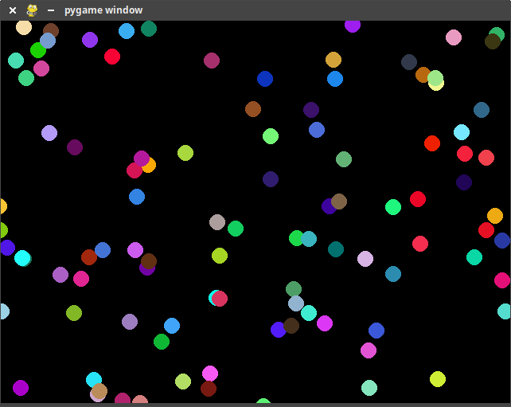

# TP : balles rebondissantes

{: .center witdh=40%}

## 1. Prise en main de Pygame

```python linenums='1'
import pygame, sys
import time
from pygame.locals import *


pygame.display.init()
fenetre = pygame.display.set_mode((640, 480))
fenetre.fill([0,0,0])

x = 300
y = 200
dx = 4
dy = -3
couleur = (45,170,250)

while True :
    fenetre.fill([0,0,0])
    pygame.draw.circle(fenetre,couleur,(x,y),10)
    
    x += dx
    y += dy
    
    pygame.display.update()
    
    # routine pour pouvoir fermer «proprement» la fenêtre Pygame
    for event in pygame.event.get():
        if event.type == pygame.QUIT:
            pygame.display.quit()
            sys.exit()
    
    
    time.sleep(0.1)
```

### 1.1  Rajout d'un rebond sur les parois
Modifiez le code précédent afin que la balle rebondisse sur chaque paroi (il suffit de modifier intelligemment les variables de vitesse ```dx``` et ```dy```).

??? info "Correction"
    ```python linenums='1'
    import pygame, sys
    import time
    from pygame.locals import *

    largeur = 64
    hauteur = 480
    taille = 20
    dx = 7
    dy = 4

    pygame.display.init()
    fenetre = pygame.display.set_mode((largeur, hauteur))
    fenetre.fill([0,0,0])

    x = largeur // 2
    y = hauteur // 2

    couleur = (45,170,250)


    while True :
        fenetre.fill([0,0,0])
        pygame.draw.circle(fenetre,couleur,(x,y),taille)

        x += dx
        y += dy
        
        # rebond en haut ou en bas
        if y < taille // 2 or y > hauteur - taille // 2:
            dy = -dy

        # rebond à gauche ou à droite
        if x < taille // 2 or x > largeur - taille // 2:
            dx = -dx

        

        pygame.display.update()

        # routine pour pouvoir fermer «proprement» la fenêtre Pygame
        for event in pygame.event.get():
            if event.type == pygame.QUIT:
                pygame.display.quit()
                sys.exit()


        time.sleep(0.03)
        ```

### 1.2 Rajout d'une deuxième balle
Attention au nommage des variables...

??? info "Correction"
    ```python linenums='1'
    
    ```

### 1.3 Gestion de la collision entre les deux balles
1. À l'aide d'un schéma (papier-crayon !), mettez en évidence le test devant être réalisé pour détecter une collision.
2. Implémentez ce test et affichez "collision" en console lorsque les deux balles se touchent.

    ??? info "Correction"
        ```python linenums='1'
        
        ```

3. Pour l'illusion du rebond, échangez les valeurs respectives de ```dx``` et ```dy``` pour les deux balles.

    ??? info "Correction"
        ```python linenums='1'
        
        ```


### 1.4 Rajout d'une troisième balle et gestion du rebond avec les deux autres.
... vraiment ? Peut-on continuer comme précédemment ?

## 2. La POO à la rescousse : création d'une classe Balle

### 2.1 la classe Balle
L'objectif est que la méthode constructeur dote chaque nouvelle balle de valeurs aléatoires : abscisse, ordonnée, vitesse, couleur...  
Créez cette classe et instanciez une balle.

Puis plusieurs balles ! (qui se collisionnent...)