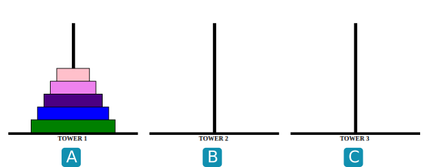
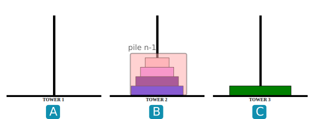

#Exercices

{{ initexo(0) }}

!!! capytale "À faire sur Capytale : [activité 8de6-74512](https://capytale2.ac-paris.fr/web/c-auth/list?returnto=/web/code/8de6-74512)"
    !!! example "{{ exercice() }}"
        === "Énoncé"
            Écrire une fonction récursive ```puissance(x,n)``` qui calcule le nombre $x^n$.
        === "Correction"
            {{ correction(True,
            "
            ```python linenums='1'
            def puissance(x, n):
                if n == 0:
                    return 1
                else:
                    return x * puissance(x, n-1)
            ```
            "
            ) }}


!!! example "{{ exercice() }} :heart: "
    === "Énoncé"
        On rappelle que le PGCD (plus grand diviseur commun de deux nombres) vérifie la propriété suivante : si la division euclidienne de $a$ par $b$ s'écrit $a = b \times q + r$, alors $pgcd(a,b)=pgcd(b,r)$. 

        Cette propriété est à la base de l'algorithme d'Euclide

        Exemple : $pgcd(24,18)=pgcd(18,6)=pgcd(6,0)$, donc $pgcd(24,18)=6$

        Écrire un algorithme récursif ```pgcd(a,b)```.
    === "Correction"
        {{ correction(True,
        "
        ```python linenums='1'
        def pgcd(a, b):
            if b == 0:
                return a
            else:
                return pgcd(b, a%b)
        ```
        "
        ) }}


!!! example "{{ exercice() }}"
    === "Énoncé"
        La conjecture de Syracuse (ou de Collatz) postule ceci :  

        *Prenons un nombre $n$ : si $n$ est pair, on le divise par 2, sinon on le multiplie par 3 puis on ajoute 1. On recommence cette opération tant que possible. Au bout d'un certain temps, on finira toujours par tomber sur le nombre 1.*

        Proposer un programme récursif ```syracuse(n)``` écrivant tous les termes de la suite de Syracuse, s'arrêtant (on l'espère) à la valeur 1.


    === "Correction"
        

!!! example "{{ exercice() }}"
    === "Énoncé"
        Reproduire le dessin suivant, à l'aide du module ```turtle```.  

        ```turtle``` est un hommage au langage LOGO inventé par [Seymour Papert](https://fr.wikipedia.org/wiki/Seymour_Papert) au MIT à la fin des années 60.

        {: .center width=40%}

    === "Correction"
        

!!! example "{{ exercice() }}"
    === "Énoncé"
        Proposer une nouvelle fonction récursive ```puissance(x,n)``` qui calcule le nombre $x^n$. Pour optimiser la fonction déjà construite à l'exercice 1, utiliser le fait que :

        - si $n$ est pair, $a^n=(a \times a)^{n/2}$
        - sinon $a^n=a \times (a \times a)^{(n-1)/2}$

    === "Correction"
        

!!! example "{{ exercice() }}"
    === "Énoncé"
        Écrire un algorithme récursif ```recherche(lst,m)``` qui recherche la présence de la valeur ```m``` dans une liste triée ```lst```. Cette fonction doit renvoyer un booléen.

    === "Correction"
        

!!! example "{{ exercice() }}"
    === "Énoncé"
        On considère le jeu des **Tours de Hanoï**.
        Le but est de faire passer toutes les assiettes de A vers C, sachant qu'une assiette ne peut être déposée que sur une assiette de diamètre inférieur.
        {: .center width=60%}

        Une version jouable en ligne peut être trouvée [ici](http://www.dynamicdrive.com/dynamicindex12/towerhanoi.htm).

        1. S'entraîner et essayer d'établir une stratégie de victoire.
        2. Observer les images ci-dessous :
        {: .center width=60%}
        {: .center width=60%}
        {: .center width=60%}
        {: .center width=60%}


        Écrire une fonction récursive ```hanoi(n, A, B, C)``` qui donnera la suite d'instructions (sous la forme " A vers C") pour faire passer une pile de taille n de A vers C en prenant B comme intermédiaire.

    === "Correction"
        

!!! example "{{ exercice() }}"
    === "Énoncé"
        Cet exercice a pour objectif le tracé du flocon de Von Koch.
        {: .center width=60%}


        L'idée est de répéter de manière récursive la transformation ci-dessous : chaque segment de longueur ```l``` donne naissance à 4 segments de longueur ```l/3```, en construisant une pointe de triangle équilatéral sur le deuxième tiers du segment.

        {: .center width=60%}


        1) Créer une fonction récursive ```floc(n,l)``` qui trace à une «profondeur» ```n``` un segment de longueur ```l```.
        {: .center width=60%}
        **Indications**

            - l'instruction de tracé n'a lieu que quand ```n``` vaut 0.
            - l'étape ```n``` fait 4 appels sucessifs à l'étape ```n-1```.

        2) Créer une fonction ```triangle(n,l)``` qui trace le flocon complet.

    === "Correction"
        

??? info "Bibliographie"
    - Numérique et Sciences Informatiques, Terminale, T. BALABONSKI, S. CONCHON, J.-C. FILLIATRE, K. NGUYEN, éditions ELLIPSES.
    - Prépabac NSI, Terminale, G.CONNAN, V.PETROV, G.ROZSAVOLGYI, L.SIGNAC, éditions HATIER.
