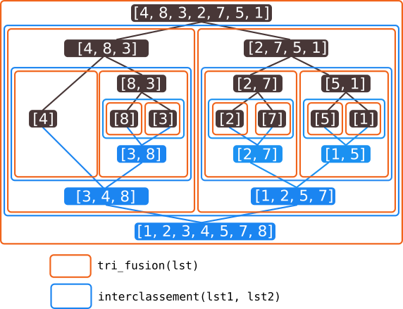
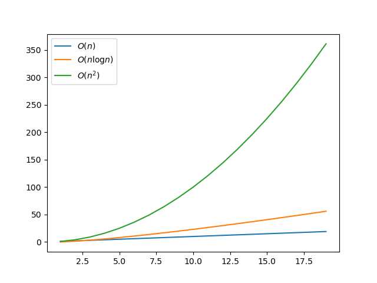

# Diviser pour régner

{: .center}

## 1. Retour sur l'algorithme de dichotomie

Nous avons vu en classe de Première l'algorithme de **dichotomie** (du grec *dikhotomia*, « division en deux parties »).

Notre but ici est la recherche de la présence (ou non) d'un élément dans une liste **triée**.  
Notre fonction renverra donc un booléen.

La recherche *naïve* (élément par élément) est naturellement de complexité linéaire. Nous allons voir que la méthode dichotomique est plus efficace.

### 1.1 Version impérative

!!! note "Dichotomie version impérative :heart:"
    ```python linenums='1'
    def recherche_dichotomique(tab, val) :
        '''
        renvoie True ou False suivant la présence de la valeur val dans le tableau trié tab.
        '''
        i_debut = 0
        i_fin = len(tab) - 1
        while i_debut <= i_fin :
            i_centre = (i_debut + i_fin) // 2     # (1)
            val_centrale = tab[i_centre]          # (2) 
            if val_centrale == val:               # (3) 
                return True
            if val_centrale < val:                # (4) 
                i_debut = i_centre + 1            # (5) 
            else :
                i_fin = i_centre - 1
        return False
    ```

    1. on prend l'indice central
    2. on prend la valeur centrale
    3. si la valeur centrale est la valeur cherchée...
    4. si la valeur centrale est trop petite...
    5. on ne prend pas la valeur centrale qui a déjà été testée

Exemple d'utilisation :

```python
>>> tab = [1, 5, 7, 9, 12, 13]
>>> recherche_dichotomique(tab, 12)
True
>>> recherche_dichotomique(tab, 17)
False
```

À chaque tour de la boucle ```while```, la taille de la liste est divisée par 2. Ceci confère à cet algorithme une **complexité logarithmique** (bien meilleure qu'une complexité linéaire).

### 1.2 Version récursive

#### 1.2.1 Préambule : le slicing
Pour écrire simplement la version récursive de cet algorithme, nous allons avoir besoin de faire du *slicing* (découpage) de listes. Cette manipulation n'est pas au programme de NSI (même si elle est très simple). Attention, elle a un coût algorithmique important, qui peut fausser notre analyse de complexité.

Exemples de slicing :

```python
>>> lst = ['a', 'b', 'c', 'd', 'e']
>>> lst[:2]
['a', 'b']
>>> lst[2:]
['c', 'd', 'e']
```

On comprend que  :

- ```lst[:k]``` va renvoyer la sous-liste composée du premier élément jusqu'à celui d'indice ```k``` **non inclus**.
- ```lst[k:]``` va renvoyer la sous-liste composée du ```k```-ième élément (**inclus**) jusqu'au dernier.
- plus généralement, ```lst[k:p]``` va renvoyer la sous-liste composée du ```k```-ième élément (**inclus**) jusqu'au ```p```-ième (**non inclus**).

#### 1.2.2 Dichotomie récursive avec slicing

!!! note "Dichotomie version récursive avec slicing :heart:"
    ```python linenums='1'
    def dichotomie_rec(tab, val):
        if len(tab) == 0:
            return False
        i_centre = len(tab) // 2
        if tab[i_centre] == val:
            return True
        if tab[i_centre] < val:
            return dichotomie_rec(tab[i_centre + 1:], val) # (1)
        else:
            return dichotomie_rec(tab[:i_centre], val)  # (2)
    ```

    1. On prend la partie droite de liste, juste après l'indice central.
    2. On prend la partie gauche de liste, juste avant l'indice central.


Exemple d'utilisation :

```python
>>> tab = [1, 5, 7, 9, 12, 13]
>>> dichotomie_rec(tab, 12)
True
>>> dichotomie_rec(tab, 17)
False
```

??? aide "Visualisation grâce à PythonTutor:"
    <iframe width="800" height="500" frameborder="0" src="https://pythontutor.com/iframe-embed.html#code=def%20dichotomie_rec%28tab,%20val%29%3A%0A%20%20%20%20if%20len%28tab%29%20%3D%3D%200%3A%0A%20%20%20%20%20%20%20%20return%20False%0A%20%20%20%20i_centre%20%3D%20len%28tab%29%20//%202%0A%20%20%20%20if%20tab%5Bi_centre%5D%20%3D%3D%20val%3A%0A%20%20%20%20%20%20%20%20return%20True%0A%20%20%20%20if%20tab%5Bi_centre%5D%20%3C%20val%3A%0A%20%20%20%20%20%20%20%20return%20dichotomie_rec%28tab%5Bi_centre%20%2B%201%3A%5D,%20val%29%20%23%20%0A%20%20%20%20else%3A%0A%20%20%20%20%20%20%20%20return%20dichotomie_rec%28tab%5B%3Ai_centre%5D,%20val%29%20%20%23%20%0A%0Atab%20%3D%20%5B1,%205,%207,%209,%2012,%2013%5D%0Adichotomie_rec%28tab,%206%29%0Adichotomie_rec%28tab,%2012%29&codeDivHeight=400&codeDivWidth=350&cumulative=false&curInstr=0&heapPrimitives=nevernest&origin=opt-frontend.js&py=3&rawInputLstJSON=%5B%5D&textReferences=false"> </iframe>

#### 1.2.3 Dichotomie récursive sans slicing

Il est possible de programmer de manière récursive la recherche dichotomique sans toucher à la liste, et donc en jouant uniquement sur les indices :

!!! note "Dichotomie version récursive sans slicing :heart:"
    ```python linenums='1'
    def dicho_rec_2(tab, val, i=0, j=None): # (1)
        if j is None:                       # (2)
            j = len(tab)-1
        if i > j :
            return False
        m = (i + j) // 2
        if tab[m] < val :
            return dicho_rec_2(tab, val, m + 1, j)
        elif tab[m] > val :
            return dicho_rec_2(tab, val, i, m - 1 )
        else :
            return True
    ```

    1. Pour pouvoir appeler simplement la fonction sans avoir à préciser les indices, on leur donne des paramètres par défaut.
    2. Il est impossible de donner ```j=len(tab)-1``` par défaut (car ```tab``` est aussi un paramètre). On passe donc par une autre valeur (ici ```None```) qu'on va ici intercepter.

Exemple d'utilisation :

```python
>>> tab = [1, 5, 7, 9, 12, 13]
>>> dicho_rec_2(tab, 12)
True
>>> dicho_rec_2(tab, 17)
False
```

## 2. Diviser pour régner

Les algorithmes de dichotomie présentés ci-dessous ont tous en commun de diviser par deux la taille des données de travail à chaque étape. Cette méthode de résolution d'un problème est connue sous le nom de *diviser pour régner*, ou *divide and conquer* en anglais.  

Une définition pourrait être :

!!! abstract "Définition :heart:"
    Un problème peut se résoudre en employant le paradigme *diviser pour régner* lorsque :  
    - il est possible de décomposer ce problème en sous-problèmes **indépendants**.  
    - la taille de ces sous-problèmes est une **fraction** du problème initial


**Remarques :**

- Les sous-problèmes peuvent nécessiter d'être ensuite recombinés entre eux (voir plus loin le tri fusion).
- Considérons de l'écriture récursive de la fonction ```factorielle``` ci-dessous :
```python
def factorielle(n):
    if n == 0:
        return 1
    else:
        return n * factorielle(n-1)
``` 
On ne peut pas parler ici de *diviser pour régner* car la taille des données à traiter est passée de *n* à *n-1*. C'est bien une diminution (qui fait que l'algorithme fonctionne) mais il n'y a pas de **division** de la taille des données.  
C'est cette division (par 2 dans le cas de la dichotomie) qui donne son efficacité à ce paradigme.

- Le paradigme *diviser pour régner* va naturellement amener à rédiger des programmes récursifs.


## 3. L'exponentiation rapide
On appelle *exponentiation* le fait de mettre en puissance un nombre. On va donc coder, de deux manières différentes, la puissance d'un nombre.

### 3.1 Algorithme classique

!!! note "Exponentiation classique :heart:"
    ```python linenums='1'
    def puissance(a, n):
        if n == 0:
            return 1
        else:
            return a * puissance(a, n-1)
    ```

### 3.2 Algorithme utilisant *diviser pour régner*

Nous allons nous appuyer sur la remarque mathématique suivante :  
Pour tout nombre $a$, 

- si $n$ est pair, $a^n = (a^2)^{\frac{n}{2}}$

- si $n$ est impair, $a^n = a \times a^{n-1} = a \times (a^2)^{\frac{n-1}{2}}$

Ainsi, dans le cas où $n$ est pair, il suffit d'élever $a$ au carré (une seule opération) pour que l'exposant diminue de **moitié**. On peut donc programmer la fonction ```puissance```  en utilisant le paradigme *diviser pour régner* : 


!!! note "Exponentiation rapide :heart:"
    ```python linenums='1'
    def puissance_mod(a, n):
        if n == 0:
            return 1
        if n % 2 == 0:
            return puissance_mod(a*a, n//2)
        else:
            return a * puissance_mod(a*a, (n-1)//2)
    ```


### 3.3 Comparaison de la vitesse d'exécution des deux algorithmes

{: .center}

!!! example "Exercice"
    === "Énoncé"
        Recréer le graphique ci-dessus, qui compare les temps d'exécution des deux fonctions ```puissance``` et ```puissance_mod```.

        **Aide pour Matplotlib :** le code ci-dessous

        ```python linenums='1'
        import matplotlib.pyplot as plt

        def carre(x):
            return x*x

        x = list(range(10))
        y = [carre(k) for k in x]
        plt.plot(x, y)
        plt.show()
        ```

        donne le graphique suivant :

        {: .center}
        
## 4. Le tri-fusion
En anglais le *merge sort*.

{: .center width=60%}

### 4.1 Preambule : l'interclassement

Le mécanisme principal du tri fusion est la **fusion** de deux listes triées en une nouvelle liste elle aussi triée.

On appelera ce mécanisme l'**interclassement**.

Principe de l'interclassement de deux listes ```lst1``` et ```lst2```.

- on part d'une liste vide ```lst_totale```
- on y ajoute alternativement les éléments de ```lst1``` et ```lst2```. Il faut pour cela gérer séparément un indice ```i1``` pour la liste ```lst1```  et un indice ```i2```  pour la liste ```i2```.
- quand une liste est épuisée, on y ajoute la totalité restante de l'autre liste.


!!! example "Exercice"
    === "Énoncé"
        Coder la fonction ```interclassement```. 
    === "Correction"
        {{ correction(True,
        "
        ```python
        def interclassement(lst1, lst2):
            i1 = 0
            i2 = 0
            lst_totale = []
            while i1 != len(lst1) and i2 != len(lst2):
                if lst1[i1] < lst2[i2]:
                    lst_totale.append(lst1[i1])
                    i1 += 1
                else:
                    lst_totale.append(lst2[i2])
                    i2 += 1
            return lst_totale + lst1[i1:] + lst2[i2:]
        ```
        "
        ) }}


### 4.2 La fusion

#### 4.2.1 Principe

L'idée du tri fusion est le découpage de la liste originale en une multitude de listes ne contenant qu'un seul élément. Ces listes élémentaires seront ensuite interclassées avec la fonction précédente.

{: .center}

**Principe de l'algorithme du tri fusion :**

- pour trier une liste, on interclasse les deux moitiés de cette liste, précédémment elles-mêmes triées par le tri fusion.
- si une liste à trier est réduite à un élément, elle est déjà triée. 


#### 4.2.2 Implémentation

La grande force de ce tri va être qu'il se programme simplement de manière **récursive**, en appelant à chaque étape la même fonction mais avec une taille de liste divisée par deux, ce qui justifie son classement parmi les algorithmes utilisants «diviser pour régner».

!!! abstract "Algorithme de tri fusion (*merge sort*) :heart: :heart: :heart:"
    ```python
    def interclassement(lst1, lst2):
        lst_totale = []
        n1, n2 = len(lst1), len(lst2)
        i1, i2 = 0, 0
        while i1 < n1 and i2 < n2:
            if lst1[i1] < lst2[i2]:
                lst_totale.append(lst1[i1])
                i1 += 1
            else:
                lst_totale.append(lst2[i2])
                i2 += 1
        return lst_totale + lst1[i1:] + lst2[i2:]

    def tri_fusion(lst):
        if len(lst) <= 1:
            return lst
        else:
            m = len(lst) // 2
            return interclassement(tri_fusion(lst[:m]), tri_fusion(lst[m:]))
    ```


#### 4.2.3 Visualisation

Une erreur classique avec les fonctions récursives est de considérer que les appels récursifs sont simultanés. C'est faux !
L'animation suivante montre la progression du tri :

{: .center}

Il est aussi conseillé d'observer l'évolution de l'algorithme grâce à PythonTutor :

<iframe width="1000" height="700" frameborder="0" src="https://pythontutor.com/iframe-embed.html#code=def%20interclassement%28lst1,%20lst2%29%3A%0A%20%20%20%20lst_totale%20%3D%20%5B%5D%0A%20%20%20%20n1,%20n2%20%3D%20len%28lst1%29,%20len%28lst2%29%0A%20%20%20%20i1,%20i2%20%3D%200,%200%0A%20%20%20%20while%20i1%20%3C%20n1%20and%20i2%20%3C%20n2%3A%0A%20%20%20%20%20%20%20%20if%20lst1%5Bi1%5D%20%3C%20lst2%5Bi2%5D%3A%0A%20%20%20%20%20%20%20%20%20%20%20%20lst_totale.append%28lst1%5Bi1%5D%29%0A%20%20%20%20%20%20%20%20%20%20%20%20i1%20%2B%3D%201%0A%20%20%20%20%20%20%20%20else%3A%0A%20%20%20%20%20%20%20%20%20%20%20%20lst_totale.append%28lst2%5Bi2%5D%29%0A%20%20%20%20%20%20%20%20%20%20%20%20i2%20%2B%3D%201%0A%20%20%20%20return%20lst_totale%20%2B%20lst1%5Bi1%3A%5D%20%2B%20lst2%5Bi2%3A%5D%0A%0Adef%20tri_fusion%28lst%29%3A%0A%20%20%20%20if%20len%28lst%29%20%3C%3D%201%3A%0A%20%20%20%20%20%20%20%20return%20lst%0A%20%20%20%20else%3A%0A%20%20%20%20%20%20%20%20m%20%3D%20len%28lst%29%20//%202%0A%20%20%20%20%20%20%20%20return%20interclassement%28tri_fusion%28lst%5B%3Am%5D%29,%20tri_fusion%28lst%5Bm%3A%5D%29%29%0A%0Alst%20%3D%20%5B4,%203,%208,%202,%207,%201,%205%5D%0Aprint%28tri_fusion%28lst%29%29&codeDivHeight=400&codeDivWidth=350&cumulative=false&curInstr=0&heapPrimitives=nevernest&origin=opt-frontend.js&py=3&rawInputLstJSON=%5B%5D&textReferences=false"> </iframe>


## 4.3 Complexité

La division par 2 de la taille de la liste pourrait nous amener à penser que le tri fusion est de complexité logarithmique, comme l'algorithme de dichotomie. Il n'en est rien.

En effet, l'instruction finale ```interclassement(tri_fusion(lst[:m]), tri_fusion(lst[m:]))``` lance **deux** appels à la fonction ```tri_fusion``` (avec certe des données d'entrée deux fois plus petites).

On peut montrer que :

!!! note "Complexité du tri fusion :heart:"
    L'algorithme de tri fusion est en $O(n \log n)$.

    On dit qu'il est **semi-logarithmique**.

Une complexité semi-logarithmique (en $O(n \log n)$) se situe «entre» une complexité linéaire (en $O(n)$) et une complexité quadratique (en $O(n^2)$).

{: .center}


Une jolie animation permettant de comparer les tris :

{: .center}

Issue de ce [site](https://www.toptal.com/developers/sorting-algorithms)


