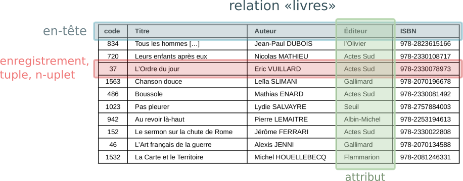
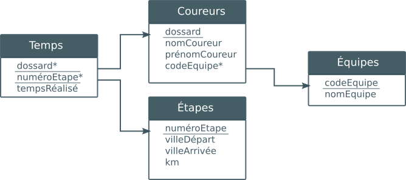

# Le modèle relationnel


## 0. De la nécessité d'organiser le stockage de ses données

Lorsqu'une grande quantité de données doit être gérée, il faut savoir distinguer deux choses :

- la structure qui va sous-tendre l'ensemble de ces données, notamment les liens entre elles, les hiérarchies éventuelles,...
- le type de logiciel qui va aider à gérer ces données.

Par exemple, si je souhaite stocker toutes les températures relevées dans mon jardin tous les matins à 07h00, je sais que mes données seront des couples ```(date, temperature)``` . Éventuellement ces dates seront regroupées par mois, ou par saison... mais la structure des données sera quand même simple et linéaire.  
Pour gérer ces données, je peux : les écrire à la main dans mon agenda, créer un feuille de tableur avec Excel ou LibreOffice, utiliser une liste dans un IDE Python,...
Chaque méthode aura ses avantages et ses inconvénients.  

{: .center width=40%}


- Si le nombre de données à stocker devient très grand, est-ce que ma solution choisie pourra les gérer ?  (on peut par exemple méditer sur le cas du Royaume-Uni dont le comptage des patients positifs au Covid est devenu faux car il a dépassé les limites de leur [feuille Excel](https://www.numerama.com/politique/653217-16-000-anglais-malades-du-covid-ont-ete-oublies-a-cause-dune-feuille-excel-trop-pleine.html){. target="_blank"})

- Est-ce que d'autres personnes que moi sont susceptibles de consulter ou modifier ces données, éventuellement en même temps que moi ?


- Si une donnée se retrouve à plusieurs endroits dans mes données, devrais-je aller modifier cette donnée partout où elle se trouve ou bien une seule fois ?

L'étude des Bases de Données tente d'apporter des réponses à toutes ces questions.

## 1. Le modèle relationnel

Le programme de Terminale NSI prévoit uniquement l'étude du **modèle relationnel**.


{: .center}
Théorisé en 1970 par le Britannique Edgard J. Codd, 
le modèle relationnel est à ce jour le modèle de base de données le plus utilisé, même si l'ère actuelle du Big Data tend à mettre en avant d'autres modèles non relationnels (nous en reparlerons).


!!! abstract "Les principes de base du modèle relationnel"
    - Les données sont regroupées dans différentes **tables** (qu'on appellera plutôt **relations** et qui donnent son nom au modèle). Chaque relation contient des éléments directement en lien avec le sujet général de la table.
    - Autant que possible, des données identiques ne doivent pas se trouver dans des tables différentes : on évite la **redondance** des données.
    - Les données ne doivent pas contenir elles-mêmes d'autres données : on parle d'**atomicité** des données.


Un modèle relationnel est donc basé sur des... **relations**.

## 2. Première relation

Prenons l'exemple d'une bibliothèque dont la base de données possède une relation «livres» :


!!! aide "Vocabulaire"
    - **relation** , ou **table** : c'est l'endroit où sont rangées les données. L'ordre des lignes (que l'on appelera des enregistrements) n'a pas d'importance.
    - **enregistrement**, ou **tuple**, ou **n-uplet**, ou **t-uplet**, ou **vecteur** : cela correspond à une ligne du tableau, et donc un ensemble de valeurs liées entre elles : l'auteur «Eric VUILLARD» a bien écrit le livre «L'Ordre du jour». 
    Il est **interdit** que deux enregistrements soient totalement identiques. 
    Le nombre d'enregistrements d'une relation s'appelle son **cardinal**.
    - **attribut** : c'est l'équivalent d'une colonne. Il y a dans notre relation un attribut «code», un attribut «Titre», etc.
    - **domaine** : le domaine désigne «le type» (au sens type ```Int```, ```Float```, ```String```). L'attribut «Éditeur» est une chaîne de caractères, par contre l'attribut «ISBN» est un nombre de 13 chiffres, commençant manifestement par 978. 
    - **schéma** : le schéma d'une relation est le regroupement de tous les attributs et de leur domaine respectif. Ici notre schéma serait ```((Code, Entier), (Titre, Chaîne de caractères), (Auteur, Chaîne de caractères), (Éditeur, Chaîne de caractères), (ISBN, Entier))``` 


## 3. Clé Primaire

!!! note "Clé primaire :heart:"
    Une clé primaire est un attribut (ou une réunion d'attributs) **dont la connaissance suffit à identifier avec certitude un unique enregistrement**.

Par exemple, la clé primaire de la relation des personnes nées en France pourrait être leur [numéro de Sécurité Sociale](https://fr.wikipedia.org/wiki/Num%C3%A9ro_de_s%C3%A9curit%C3%A9_sociale_en_France){:target="_blank"}.


 Observons, dans notre relation précédente, ce qui peut être une clé primaire et ce qui ne peut pas l'être.

- Titre : cet attribut pourrait jouer le rôle de clé primaire. En effet, notre table ne contient pas deux livres ayant le même titre.
- Auteur : cet attribut pourrait jouer le rôle de clé primaire. En effet, notre table ne contient pas deux livres ayant le même auteur.
- Éditeur : cet attribut ne peut **pas** jouer le rôle de clé primaire. En effet, la donnée de l'attribut «Actes Sud» renvoie vers 4 livres différents.
- ISBN : (International Standard Book Number) cet attribut est un numéro unique spécifique à chaque livre : il peut jouer le rôle de clé primaire.
- Code : cet attribut pourrait jouer le rôle de clé primaire. En effet, notre table ne contient pas deux livres ayant le même code.

Alors, quelle clé primaire choisir ? Il faut pour cela réfléchir à ce que deviendrait notre relation si elle contenait 1000 livres au lieu de 10. Il est fort probable que deux livres aient alors le même auteur : l'attribut «Auteur» ne serait donc plus une clé primaire. 
Il peut arriver aussi que deux livres aient le même titre : l'attribut «Titre» n'est donc pas une bonne clé primaire.

Par définition, l'attribut «ISBN» pourrait jouer le rôle de clé primaire.

Quant à l'attribut «Code», il s'agit sans doute d'une nomenclature «maison» correspondant à une étiquette collée sur la tranche des livres : c'est donc une clé primaire qu'on qualifiera d'«artificielle».  

Attention, il ne peut pas y avoir deux clés primaires dans une table. La clé primaire choisie ici serait sans aucun doute l'attribut «Code».

## 4. D'autres relations

Ajoutons maintenant les relations ci-dessous :

 **Relation «Emprunts»** 

| id_emprunteur | date       | Nom    | Prénom | titre             | auteur          | code |
|---------------|------------|--------|--------|-------------------|-----------------|------|
| 845           | 12/10/2020 | DURAND | Michel | Au revoir là-haut | Pierre LEMAITRE | 942  |
| 125           | 13/10/2020 | MARTIN | Jean   | Pas pleurer       | Lydie SALVAYRE  | 1023 |
| 125           | 13/10/2020 | MARTIN | Jean   | Boussole          | Mathias ENARD   | 486  |

 **Relation «Emprunteurs»** 

| id_emprunteur | Nom    | Prénom | 
|---------------|--------|--------|
| 129           | DULAC | Marcel  | 
| 845           | DURAND | Michel |
| 125           | MARTIN | Jean   |

L'attribut «id_emprunteur» est une clé primaire de la relation «Emprunteurs».


**Notion de clé étrangère** 

Y-a-t-il une clé primaire dans la relation «Emprunts» ? 

«id_emprunteur» est bien une clé primaire (d'«Emprunteurs») mais ne peut pas être une clé primaire d'«Emprunts», car une personne peut prendre plusieurs livres à la fois : on dit que c'est une **clé étrangère**. 

!!! note "Clé étrangère :heart:"
    Une clé étrangère est une clé primaire d'une autre relation.

«code» est aussi une clé étrangère : c'est une clé primaire (de la relation «livres») mais elle ne peut pas jouer le rôle de clé primaire pour la relation emprunt, car un même livre pourra être pris à différentes dates.

Une clé primaire pourrait alors être la combinaison («date», «code»). En effet, aucun livre ne pouvant être emprunté deux fois le même jour, la connaissance de «date» et «code» suffit à identifier n'importe quel enregistrement.

## 5. Redondance des données

La relation «Emprunts» contient des informations qui sont déjà disponibles dans d'autres relations : on dit qu'elle est **redondante**, et c'est quelque chose qu'il faut éviter. À la fois pour des raisons d'espace de stockage mais aussi de cohérence : si une modification doit être faite (un emprunteur change de prénom), cette modification ne doit être faite qu'à un seul endroit de notre base de données.

Une version non-redondante de la relation «Emprunteurs» serait donc celle-ci :

**Relation «Emprunts»** 

| id_emprunteur | date       | code |
|---------------|------------|------|
| 845           | 12/10/2020 | 942  |
| 125           | 13/10/2020 | 1023 |
| 125           | 13/10/2020 | 486  |

## 6. Contraintes d'intégrité

### 6.1 Contrainte de domaine
Tout attribut d'un enregistrement doit respecter le domaine indiqué dans le schéma relationnel.

Attention, certains domaines sont subtils. Par exemple, si une relation possède un attribut "Code Postal", le domaine de cet attribut devra être ```String``` plutôt que ```Entier``` . Dans le cas contraire, un enregistrement possédant le code postal ```03150``` serait converti en ```3150``` (car pour les entiers, 03150 = 3150). Or le code postal ```3150``` n'existe pas.

### 6.2 Contrainte de relation
La contrainte de relation impose que tout enregistrement soit unique : cette contrainte est réalisée par l'existence obligatoire d'une clé primaire.
Cette clé primaire est souvent créée de manière artificielle (voir ```id_emprunteurs```  dans la table ci-dessus par exemple).

### 6.3 Contrainte de référence
La cohérence entre les différentes tables d'une base de données est assurée par les clés étrangères : dans une table, la valeur d'un attribut qui est clé étrangère doit obligatoirement pouvoir être retrouvée dans la table dont cet attribut est clé primaire.

Par exemple, la relation «Emprunts_v2» ci-dessous n'est pas valable :

**Relation «Emprunts_v2»** 

| id_emprunteur | date       | code |
|---------------|------------|------|
| 845           | 12/10/2020 | 942  |
| 125           | 13/10/2020 | 1023 |
| 125           | 13/10/2020 | **511**  |

En effet, le code 511 (clé étrangère de ma table «Emprunts_v2») ne correspond à aucun enregistrement dans la table dont il est clé primaire (la table «Livres») :



Il n'y a pas de code 511, donc ma relation «Emprunts_v2» ne respecte pas la contrainte de référence, et provoquerait une erreur du SGBD.


## 7. Représentation usuelles des bases de données en modèle relationnel

Considérons la base de données Tour de France 2020, contenant les relations suivantes :
(d'après une idée de [Didier Boulle](http://webtic.free.fr/sql/mldr.htm))

**relation Équipes**

| codeEquipe | nomEquipe                      |
|------|-----------------------------|
| ALM  |  AG2R La Mondiale           |
| AST  |  Astana Pro Team            |
| TBM  |  Bahrain - McLaren          |
| BOH  |  BORA - hansgrohe           |
| CCC  |  CCC Team                   |
| COF  |  Cofidis, Solutions Crédits |
| DQT  |  Deceuninck - Quick Step    |
| EF1  |  EF Pro Cycling             |
| GFC  |  Groupama - FDJ             |
| LTS  |  Lotto Soudal               |
| ...  | ...                         |

Le schéma relationnel de cette table s'écrira souvent :
Equipes ( <ins>codeEquipe</ins>  ```String```,  nomEquipe ```String``` ) 

Notez le soulignement sous le mot «codeEquipe», qui signifie que cet attribut est une clé primaire. 
Les clés étrangères, lorsqu'elles existent, peuvent être signalées par une astérisque *.


**relation Coureurs**

| dossard | nomCoureur  | prénomCoureur | codeEquipe |
|---------------|-------------|---------------|------------|
| 141           | LÓPEZ       | Miguel Ángel  | AST        |
| 142           | FRAILE      | Omar          | AST        |
| 143           | HOULE       | Hugo          | AST        |
| 11            | ROGLIČ      | Primož        | TJV        |
| 12            | BENNETT     | George        | TJV        |
| 41            | ALAPHILIPPE | Julian        | DQT        |
| 44            | CAVAGNA     | Rémi          | DQT        |
| 45            | DECLERCQ    | Tim           | DQT        |
| 121           | MARTIN      | Guillaume     | COF        |
| 122           | CONSONNI    | Simone        | COF        |
| 123           | EDET        | Nicolas       | COF        |
| …             | …           | …             | …          |

Schéma : 
Equipes ( <ins>dossard</ins>  ```Int```,  nomCoureur ```String```,  prénomCoureur ```String```,   codeEquipe* ```String``` ) 


**relation Étapes**

| numéroEtape | villeDépart | villeArrivée      | km  |
|-------------|-------------|-------------------|-----|
| 1           | Nice        | Nice              | 156 |
| 2           | Nice        | Nice              | 185 |
| 3           | Nice        | Sisteron          | 198 |
| 4           | Sisteron    | Orcières-Merlette | 160 |
| 5           | Gap         | Privas            | 198 |
| ...         | ...         | ...               | ... |

Schéma : 
Étapes ( <ins>numéroEtape</ins>  ```Int```,  villeDépart ```String```,  villeArrivée ```String```,   km ```Int``` ) 


**relation Temps**

| dossard | numéroEtape | tempsRéalisé |
|:-------------:|:-----------:|:------------:|
| 41            | 2           | 04:55:27     |
| 121           | 4           | 04:07:47     |
| 11            | 5           | 04:21:22     |
| 122           | 5           | 04:21:22     |
| 41           | 4           | 04:08:24     |
| ...           | ...         | ...          |

Schéma : 
Temps ( <ins>dossard</ins>*  ```Int```,  <ins>numéroEtape</ins> *  ```Int```,  tempsRéalisé ```String```) 

Remarquez que la clé primaire de cette relation est le couple dossard-numéroEtape.


**Représentation graphique**




---
## Bibliographie
- Numérique et Sciences Informatiques, Terminale, T. BALABONSKI, S. CONCHON, J.-C. FILLIATRE, K. NGUYEN, éditions ELLIPSES.
- Prépabac NSI, Terminale, G.CONNAN, V.PETROV, G.ROZSAVOLGYI, L.SIGNAC, éditions HATIER.
- Cours d'Olivier Lécluse, [https://lecluseo.frama.io/leclusemaths/nsi/NSI_T/bdd/modrel/](https://lecluseo.frama.io/leclusemaths/nsi/NSI_T/bdd/modrel/)
- [https://www.procyclingstats.com/](https://www.procyclingstats.com/)


---
