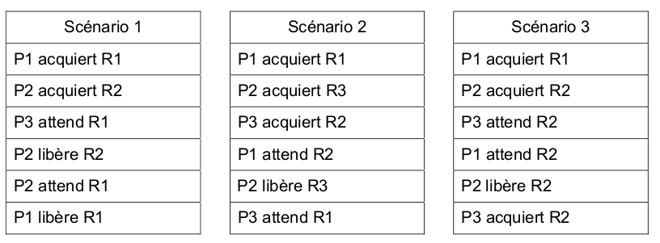

## Exercice 1
_2021, sujet Amérique du Nord_

Un constructeur automobile utilise des ordinateurs pour la conception de ses véhicules.
Ceux-ci sont munis d'un système d'exploitation ainsi que de nombreuses applications parmi lesquelles on peut citer :

- un logiciel de traitement de texte ;
- un tableur ;
- un logiciel de Conception Assistée par Ordinateur (CAO) ;
- un système de gestion de base de données (SGBD)

Chaque ordinateur est équipé des périphériques classiques : clavier, souris, écran et est relié à une imprimante réseau.

1. *(question System On Chip)*
2. Un ingénieur travaille sur son ordinateur et utilise les quatre applications citées au début de l'énoncé.  
Pendant l'exécution de ces applications, des processus mobilisent des données et sont en attente d'autres données mobilisées par d'autres processus.  
On donne ci-dessous un tableau indiquant à un instant précis l'état des processus en cours d'exécution et dans lequel D1, D2, D3, D4 et D5 sont des données.

La lettre M signifie que la donnée est mobilisée par l'application ; la lettre A signifie que l'application est en attente de cette donnée.

Lecture du tableau : le logiciel de traitement de texte mobilise (M) la donnée D1 et est en attente (A) de la donnée D2.

| | D1 | D2 | D3 | D4 | D5|
|:---:|:---:|:---:|:---:|:---:|:---:|
| Traitement de texte | M | A |-|-|-|
| Tableur | A | - |-|-|M|
| SGBD | - | M |A|A|-|
| CAO | - | - |A|M|A|

Montrer que les applications s'attendent mutuellement. Comment s'appelle cette situation ?


## Exercice 2
_2021, Métropole sujet 1_

**Partie A**
Cette partie est un questionnaire à choix multiples (QCM).
Pour chacune des questions, une seule des quatre réponses est exacte.

1. Parmi les commandes ci-dessous, laquelle permet d’afficher les processus en cours
d’exécution ?
    - a. ```dir```
    - b. ```ps``` 
    - c. ```man``` 
    - d.   ```ls```
2. Quelle abréviation désigne l’identifiant d’un processus dans un système d’exploitation de type UNIX ?
    - a. PIX
    - b. SIG 
    - c. PID 
    - d. SID
3. Comment s'appelle la gestion du partage de processeur entre les différents processus ?
    - a. L'interblocage
    - b. L'ordonnancement
    - c. La planification
    - d. La priorisation
4. Quelle commande permet d’interrompre un processus dans un système d’exploitation de type
UNIX ?
    - a. ```stop```
    - b. ```interrupt``` 
    - c. ```end``` 
    - d.   ```kill```

**Partie B**

**Q1.** Un processeur choisit à chaque cycle d’exécution le processus qui doit être exécuté. Le
tableau ci-dessous donne pour trois processus P1, P2, P3 :

- la durée d’exécution (en nombre de cycles),
- l’instant d’arrivée sur le processeur (exprimé en nombre de cycles à partir de 0),
- le numéro de priorité.

Le numéro de priorité est d’autant plus petit que la priorité est grande. On suppose qu’à chaque instant, c’est le processus qui a le plus petit numéro de priorité qui est exécuté, ce qui peut provoquer la suspension d’un autre processus, lequel reprendra lorsqu’il sera le plus prioritaire.

{: .center}
Reproduire le tableau ci-dessous sur la copie et indiquer dans chacune des cases le processus
exécuté à chaque cycle.
{: .center}

**Q2.** On suppose maintenant que les trois processus précédents s’exécutent et utilisent une ou plusieurs ressources parmi R1, R2 et R3.
Parmi les scénarios suivants, lequel provoque un interblocage ? Justifier.

{: .center}

