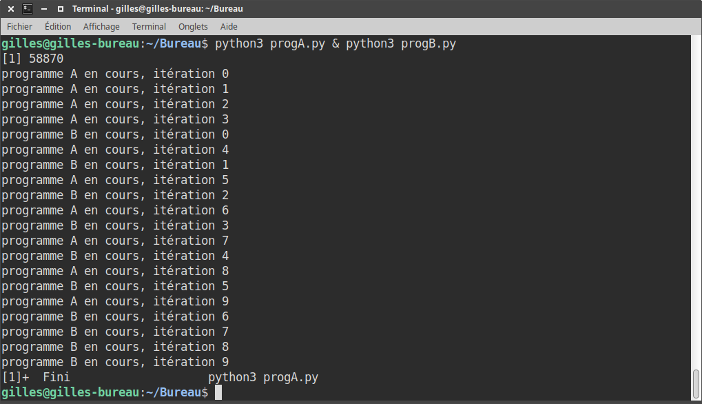

# Gestion des processus

{: .center}

{: .center width=40%}

## 1. Notion de processus

### 1.1 Définition d'un processus

Lorsqu'un programme est exécuté sur un ordinateur, celui-ci va créer un (ou plusieurs) **processus**.

On dit que ce processus est une **instance d'exécution** de ce programme.

Un processus est caractérisé par :

- l'ensemble des instructions qu'il va devoir accomplir (écrites dans le fichier exécutable obtenu par la compilation du code-source du programme)
- les ressources que le programme va mobiliser (fichier en ouverture, carte son...)
- l'état des registres du processeur (voir le cours sur l'architecture Von Neumann en Première)


### 1.2 Observation des processus sous Linux

### 1.2.1 La commande ```ps``` 

Dans un terminal, la commande ```ps``` va permettre d'afficher la liste des processus actifs. 

(plus précisément, la commande ```ps -lu nom_user``` )

{: .center}

On retrouve notamment dans ce tableau les colonnes :

- ```CMD```  (Command) : le nom de la commande qui a créé le processus. Vous pouvez y retrouver par ordre chronologique le nom de tous les programmes actifs. Certains sont ceux que vous avez ouverts volontairement (navigateur...) mais on y trouve surtout tous les programmes nécessaires au bon fonctionnement du système d'exploitation. Le dernier processus en bas de la liste est forcément ```ps```, puisque vous venez de l'appeler.

- ```PID``` (Personnal Identifier) : le numéro unique d'identification, affecté chronologiquement par le système d'exploitation. Le processus de PID égal à 1 est ```systemd```, qui est le [tout premier programme](https://doc.ubuntu-fr.org/systemd){. target="_blank"} lancé par le noyau Linux au démarrage. 

- ```PPID``` (Parent PID) : certains processus vont *eux-mêmes* lancer plusieurs processus-fils, qui porteront le même nom. C'est ainsi qu'on peut retrouver de multiples processus s'appelant ```chrome``` :

{: .center}

Ici, l'instance «principale» de Chrome (```PID``` 1453) a généré 6 autres instances de ```PID``` différents, dont le ```PPID``` vaut 1453.

> Dans Chrome/Chromium, vous pouvez comprendre le rôle de chaque processus en le retrouvant dans le gestionnaire des tâches (clic-droit sur une zone vide de la barre d'onglets)

### 1.2.2 La commande ```pstree``` 

À noter que la commande ```pstree``` permet d'afficher les processus sous forme d'arborescence : 

{: .center}

### 1.2.3 La commande ```top``` 

La commande ```top``` permet de connaître en temps réel la liste des processus, classés par ordre décroissant de consommation de CPU. 

On ferme ```top``` par la combinaison de touches ```Ctrl-C```.

Si on repère alors un processus qui consomme beaucoup trop de ressources, on peut utiliser...

### 1.2.4 La commande ```kill``` 
La commande ```kill``` permet de fermer un processus, en donnant son ```PID```  en argument.

Exemple : ```kill 1453``` tuera Chrome (voir la capture du 1.2.1)


{: .center width=50%}


## 2. Ordonnancement

### 2.1 Expérience : les processus fonctionnent ~~simultanément~~ à tour de rôle.  
Un ordinateur donne l'illusion de réaliser plusieurs tâches simultanément. Hormis pour les processeurs fonctionnant avec plusieurs cœurs, il n'en est rien.

Les processus s'exécutent les uns après les autres, le processeur ne pouvant en traiter qu'un seul à la fois. Un cadencement extrêmement rapide et efficace donne l'apparence d'une fausse simultanéité. Nous allons la mettre en évidence :

Considérons les fichiers ```progA.py``` et ```progB.py``` ci-dessous :

```python title="progA.py"
import time

for i in range(10):
    print("programme A en cours, itération", i)
    time.sleep(0.02)  
```

```python title="progB.py"
import time
time.sleep(0.01)
for i in range(10):
    print("programme B en cours, itération", i)
    time.sleep(0.02)  
```

Le programme ```progB.py``` est légèrement retardé au démarrage par le ```time.sleep(0.01)```.
Il devrait donc en résulter un entrelacement entre les phrases ```programme A en cours``` et ```programme B en cours```.  

L'exécution «d'apparence simultanée» de ces deux programmes peut se faire dans un Terminal via la commande ```python3 progA.py & python3 progB.py```.

Il en résulte ceci :

{: .center}

Nous retrouvons bien l'alternance prévue à la lecture du code.  
Tout se passe donc comme si les deux processus avaient été lancés et traités simultanément.

Réduisons maintenant les temporisations (en passant du centième de seconde à la milliseconde): 

```python title="progA.py"
import time

for i in range(10):
    print("programme A en cours, itération", i)
    time.sleep(0.002)  
```

```python title="progB.py"
import time
time.sleep(0.001)
for i in range(10):
    print("programme B en cours, itération", i)
    time.sleep(0.002)  
```

Il en résulte maintenant ceci :

{: .center}

L'alternance prévue n'est plus respectée (et les résultats deviennent non-reproductibles).

Si la gestion des processus était réellement simultanée, même en considérant des ralentissements du processeur par des sollicitations extérieures, chaque processus serait ralenti de la même manière : l'entrelacement des phrases serait toujours le même. 

En réalité, le processeur passe son temps à alterner entre les divers processus qu'il a à gérer, et les met en attente quand il ne peut pas s'occuper d'eux. Il obéit pour cela aux instructions de son **ordonnanceur**.


## 2.2 L'ordonnancement des processus
-


## 3. Interblocage


<!--
## biblio

http://info-mounier.fr/terminale_nsi/archi_se_reseaux/processus.php
http://lycee.educinfo.org/index.php?page=creation_thread&activite=processus
https://www.lecluse.fr/nsi/NSI_T/archi/process/

-->