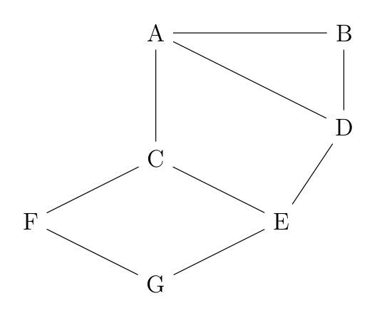
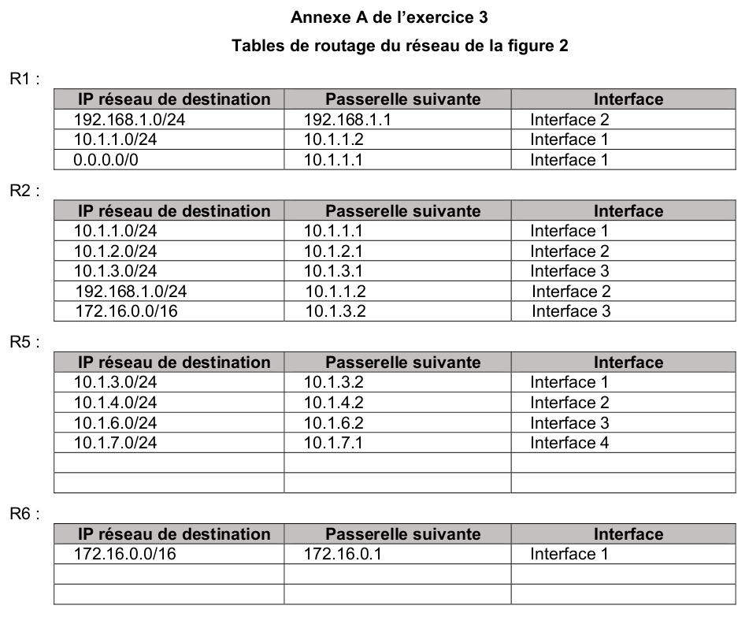
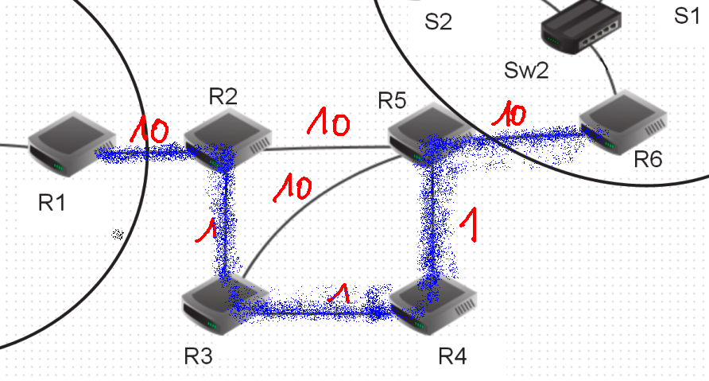
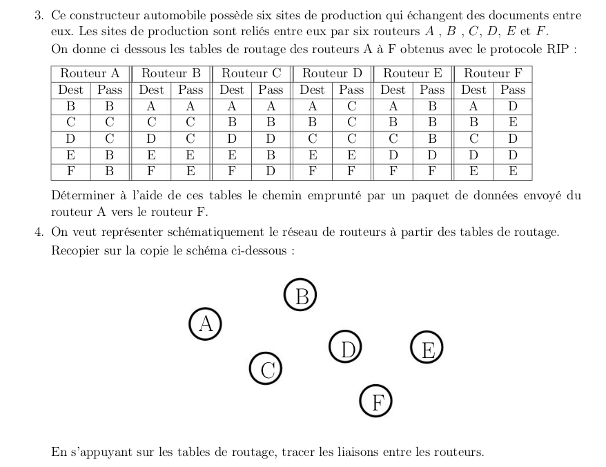

## Exercice 1

Créer une fonction ```meme_sous_reseau(ip_a, ip_b, masque)``` qui renvoie un booléen indiquant si A et B sont partie du même sous-réseau.

Exercice à réaliser en Test Driven Developpement à partir du squelette de code ci-dessous, en testant chaque fonction après sa réalisation, jusqu'à la fonction finale.


```python
def convert_ip_to_list(ip):
    """
    entrée : ip (string) 
    sortie : liste d'entiers
    """
    # à vous

def test_convert_ip_to_list():
    assert convert_ip_to_list('192.168.0.1') == [192, 168, 0, 1]
    

def nb_to_binary_word(masque):
    """
    entrée : masque (int)
    sortie : string
    """
    # à vous
    
def test_nb_convert_to_binary_word():
    assert nb_to_binary_word(24) == '11111111111111111111111100000000'


def binary_word_to_list(word):
    """
    entrée : word (string de 32 caractères)
    sortie : liste de 4 entiers
    """
    # à vous


def test_binary_word_to_list():
    assert binary_word_to_list('11111111111111111111111100000000') == [255, 255, 255, 0]


def meme_sous_reseau(ip_a, ip_b, masque):
    """
    ip_a:  string contenant une IP (ex "192.168.0.1")
    ip_b : string contenant une IP
    masque : entier du masque en notation CIDR (ex : 24)
    renvoie un booléen indiquant si ip_a et ip_b sont dans
    le même sous-réseau
    """
    # à vous
    

def test_meme_sous_reseau():
    assert meme_sous_reseau("192.168.0.1", "192.168.1.3", 24) == False
    assert meme_sous_reseau("192.168.0.1", "192.168.1.3", 20) == True
    assert meme_sous_reseau("192.168.0.1", "192.168.0.3", 30) == True
```


## Exercice 2
_2020, sujet 0_

On considère un réseau composé de plusieurs routeurs reliés de la façon suivante :

{: .center width=40%}


Le protocole RIP permet de construire les tables de routage des différents routeurs, en indiquant pour chaque routeur la distance, en nombre de sauts, qui le sépare d’un autre routeur. Pour le réseau ci-dessus, on dispose des tables de routage suivantes :

{: .center width=80%}

**Question 1**

1. Le routeur A doit transmettre un message au routeur G, en effectuant un nombre minimal de
sauts. Déterminer le trajet parcouru.
2. Déterminer une table de routage possible pour le routeur G obtenu à l’aide du protocole RIP.

**Question 2**

Le routeur C tombe en panne. Reconstruire la table de routage du routeur A en suivant le
protocole RIP.


## Exercice 3
_2021, sujet Métropole 1_

On représente ci-dessous un réseau dans lequel R1, R2, R3, R4, R5 et R6 sont des
routeurs. Le réseau local L1 est relié au routeur R1 et le réseau local L2 au routeur R6.

{: .center width=70%}


Dans cet exercice, les adresses IP sont composées de 4 octets, soit 32 bits. Elles sont notées X1.X2.X3.X4, où X1, X2, X3 et X4 sont les valeurs des 4 octets, convertis en notation décimale.
La notation X1.X2.X3.X4/n signifie que les n premiers bits de poids forts de l’adresse IP représentent la partie « réseau », les bits suivants représentent la partie « hôte ».
Toutes les adresses des hôtes connectés à un réseau local ont la même partie réseau et peuvent donc communiquer directement. L’adresse IP dont tous les bits de la partie « hôte » sont à 0 est appelée « adresse du réseau ».

On donne également des extraits de la table de routage des routeurs R1 à R5 dans le
tableau suivant :

{: .center width=70%}

1/ Un paquet part du réseau local L1 à destination du réseau local L2.

1.a. En utilisant l’extrait de la table de routage de R1, vers quel routeur R1 envoie-t-il ce paquet : R2 ou R3 ? Justifier.

1.b. A l’aide des extraits de tables de routage ci-dessus, nommer les routeurs traversés par ce paquet, lorsqu’il va du réseau L1 au réseau L2.

2/ La liaison entre R1 et R2 est rompue.

2.a. Sachant que ce réseau utilise le protocole RIP (distance en nombre de sauts), donner l’un des deux chemins possibles que pourra suivre un paquet allant de L1 vers L2.

2.b. Dans les extraits de tables de routage ci-dessus, pour le chemin de la question 2.a, quelle(s) ligne(s) sera (seront) modifiée(s) ?

3/ On a rétabli la liaison entre R1 et R2.
Par ailleurs, pour tenir compte du débit des liaisons, on décide d’utiliser le
protocole OSPF (distance liée au coût minimal des liaisons) pour effectuer le
routage. Le coût des liaisons entre les routeurs est donné par le tableau suivant :

{: .center width=90%}

a. Le coût _C_ d’une liaison est donné ici par la formule
$C = \frac{10^9}{BP}$

où $BP$ est la bande passante de la connexion en bps (bits par seconde).
Sachant que la bande passante de la liaison R2-R3 est de 10 Mbps, calculer le coût correspondant.


b. Déterminer le chemin parcouru par un paquet partant du réseau L1 et arrivant au réseau L2, en utilisant le protocole OSPF.

c. Indiquer pour quel(s) routeur(s) l’extrait de la table de routage sera modifié pour un paquet à destination de L2, avec la métrique OSPF.

??? tip "Correction"
    1.a. D'après la table, R1 doit passer par la passerelle 86.154.10.1 qui correspond au routeur R2.  
    1.b. Le paquet va traverser R1, R2, R6 avant d'arriver à L2.  
    2.a. RIP doit minimiser le nombre de sauts, donc les deux chemins minimaux possibles sont R1-R3-R4-R6 et R1-R3-R2-R6.  
    2.b. La ligne R1 sera modifiée, il faudra partir vers R3 (et son réseau 112.44.65.0/24). Les autres lignes n'ont pas à être modifiées puisque R3 amène en R4 qui amène en R6.  
    3.a $\dfrac{10^9}{10 \times 10^6}=100$ donc le coût R2-R3 est 100.  
    3.b. Avec OSPF, le chemin qui minimise le coût est le chemin R1-R2-R4-R5-R6 (coût 103) :
    {: .center width=50%}
    3.c. Dans la table de routage initiale, il faut modifier R2 pour qu'elle envoie sur R4 (et non sur R6), mais aussi R4 pour qu'elle envoie sur R5 (et non sur R6).
    


## Exercice 4
_2021, sujet Métropole 2_

|  | 
|:--:| 
| *Figure 1* |

La figure 1 ci-dessus représente le schéma d’un réseau d’entreprise. Il y figure deux réseaux locaux L1 et L2. Ces deux réseaux locaux sont interconnectés par les routeurs R2, R3, R4 et R5. Le réseau local L1 est constitué des PC portables P1 et P2 connectés à la passerelle R1 par le switch Sw1. Les serveurs S1 et S2 sont connectés à la passerelle R6 par le switch Sw2.

 Le tableau 1 suivant indique les adresses IPv4 des machines constituants le réseau de l’entreprise.

 |   | 
|:--:| 
| *Tableau 1 : adresses IPv4 des machines* |

**Rappels et notations**

Rappelons qu’une adresse IP est composée de 4 octets, soit 32 bits. Elle est notée
X1.X2.X3.X4, où X1, X2, X3 et X4 sont les valeurs des 4 octets. Dans le tableau 1, les valeurs des 4 octets ont été converties en notation décimale.

La notation X1.X2.X3.X4/n signifie que les n premiers bits de poids forts de l’adresse IP représentent la partie « réseau », les bits suivants de poids faibles représentent la partie « machine ».

Toutes les adresses des machines connectées à un réseau local ont la même partie réseau.
L’adresse IP dont tous les bits de la partie « machine » sont à 0 est appelée « adresse du réseau ».
L’adresse IP dont tous les bits de la partie « machine » sont à 1 est appelée « adresse de diffusion ».

1/ 
1.a. Quelles sont les adresses des réseaux locaux L1 et L2 ?

1.b. Donner la plus petite et la plus grande adresse IP valides pouvant être attribuées à un ordinateur portable ou un serveur sur chacun des réseaux L1 et L2 sachant que l’adresse du réseau et l’adresse de diffusion ne peuvent pas être attribuées à une machine.

1.c. Combien de machines peut-on connecter au maximum à chacun des réseaux locaux L1
et L2 ? 

2/ 
2.a. Expliquer l’utilité d’avoir plusieurs chemins possibles reliant les réseaux L1 et L2.

2.b. Quel est le chemin le plus court en nombre de sauts pour relier R1 et R6 ? Donner le nombre de sauts de ce chemin et préciser les routeurs utilisés.

2.c. La bande passante d’une liaison Ether (quantité d’information qui peut être transmise en bits/s) est de $10^7$ bits/s et celle d’une liaison FastEther est de $10^8$ bits/s. Le coût d’une liaison est défini par $\frac{10^8}{d}$ , où $d$ est sa bande passante en bits/s.

 |   | 
|:--:| 
| *Tableau 2 : type des liaisons entre les routeurs* |

Quel est le chemin reliant R1 et R6 qui a le plus petit coût ? Donner le coût de ce chemin et préciser les routeurs utilisés.

3/ Dans l’annexe A figurent les tables de routages des routeurs R1, R2, R5 et R6 au
démarrage du réseau. Indiquer sur votre copie ce qui doit figurer dans les lignes laissées vides des tables de routage des routeurs R5 et R6 pour que les échanges entre les ordinateurs des réseaux L1 et L2 se fassent en empruntant le chemin le plus court en nombre de sauts.



??? tip "Correction"
    1.a L'adresse du réseau L1 est 192.168.1.0/24. L'adresse de L2 est 175.6.0.0/16.   
    1.b Pour le réseau L1 (192.168.1.0/24), l'adresse min est 192.168.1.1/24, l'adresse max est 192.168.1.254/24.  
    Pour le réseau L2 (175.6.0.0/16), l'adresse min est 175.6.0.1/16 et l'adresse max est 175.6.255.254/16  
    1.c. Pour le réseau L1, il y a donc 254 adresses (256 moins les deux interdites)  
    Pour le réseau L2, il y en a $256^2-2$, soit 65534.

    2.a Il est utile d'avoir plusieurs chemins en cas de panne d'un routeur.  
    2.b En nombres de sauts (protocole RIP), le chemin le plus court est R1-R2-R5-R6, qui contient 3 sauts.  
    2.c Les liaisons Ether ont un coût de 10, les liaisons FastEther ont un coût de 1. Ce qui donne :
    {: .center width=50%}
    Le chemin le plus court est donc R1-R2-R3-R4-R5-R6, avec un coût total de 23.

    3. On veut que le chemin soit le plus court en nombre de sauts, donc il faut que le chemin soit R1-R2-R5-R6.
    {: .center width=70%}
    Dans la table R5, il manque les lignes

    | IP destination | Passerelle | Interface|
    |:--:|:--:|:--:|
    |192.168.1.0/24|10.1.3.1|Interface 1|
    |172.16.0.0/16|10.1.7.2|Interface 4|  
    

     Dans la table R6, il manque les lignes

    | IP destination | Passerelle | Interface|
    |:--:|:--:|:--:|
    |10.1.7.0/24|10.1.7.1|Interface 2|
    |192.168.1.0/24|10.1.7.1|Interface 2|
    

## Exercice 5
_2021, sujet Amérique du Nord_

{: .center}
